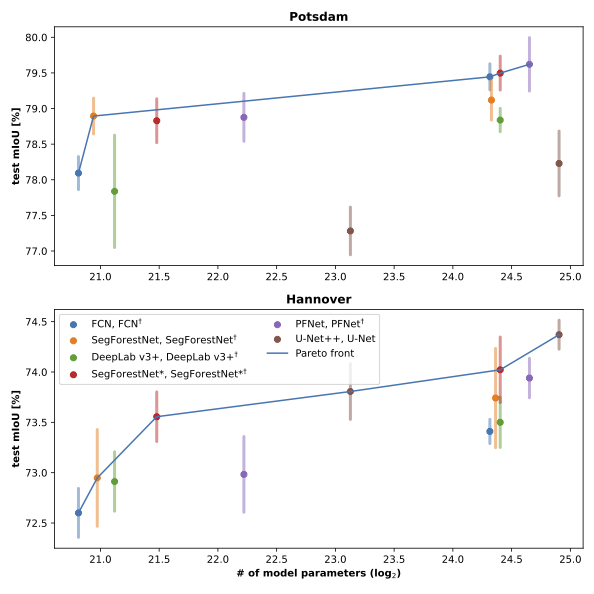
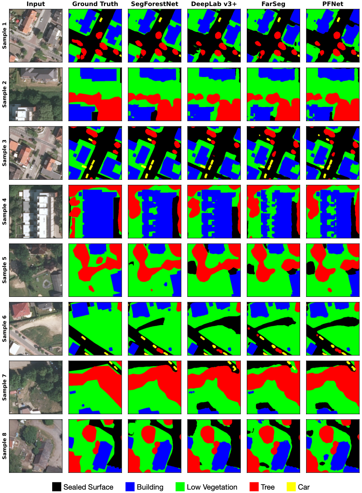

# SegForestNet
Reference implementation of SegForestNet, a model which predicts binary space partitioning trees to compute a semantic segmentation of aerial images. [The associated paper titled "SegForestNet: Spatial-Partitioning-Based Aerial Image Segmentation" is available on arXiv](https://arxiv.org/abs/2302.01585). Please cite our paper if you use anything from this repository.

```bibtex
@misc{https://doi.org/10.48550/arxiv.2302.01585,
  doi = {10.48550/ARXIV.2302.01585},
  url = {https://arxiv.org/abs/2302.01585},
  author = {Gritzner, Daniel and Ostermann, Jörn},
  keywords = {Computer Vision and Pattern Recognition (cs.CV), FOS: Computer and information sciences, FOS: Computer and information sciences, I.5.4},
  title = {SegForestNet: Spatial-Partitioning-Based Aerial Image Segmentation},
  publisher = {arXiv},
  year = {2023},
  copyright = {Creative Commons Attribution 4.0 International}
}
```

# Results
Our model delivers state-of-the-art performance while using up to 60% fewer model parameters. The table below shows results comparing our model to various other models, all using MobileNetv2 as a backbone. The paper includes more comparisons, e.g., to U-Net variants and using Xception as a backbone instead.

| | Hannover | Nienburg | Buxtehude | Potsdam | Vaihingen | Toulouse | iSAID |
| :----: | :----: | :----: | :----: | :----: | :----: | :----: | :----: |
| FCN | 72.6% | 73.2% | 76.2% | 78.1% | 72.0% | 54.1% | 38.3% |
| __SegForestNet__ | 72.9% | 73.8% | 76.2% | **78.9%** | 72.9% | 52.9% | 44.5% |
| DeepLab v3+ | 72.9% | 73.8% | 76.5% | 77.8% | 72.2% | 52.8% | 34.9% |
| RA-FCN | 71.0% | 71.0% | 74.1% | 74.1% | 70.3% | 49.4% | 35.4% |
| __SegForestNet*__ | **73.6%** | 74.1% | 76.2% | 78.8% | **72.9%** | **54.2%** | 42.8% |
| PFNet | 73.0% | **74.2%** | **76.8%** | **78.9%** | 72.6% | 53.9% | **45.8%** |




# How to run
### Dependencies
The code has been tested on openSUSE Leap 15.4 running the following software:
* cargo 1.54.0
* cudatoolkit 10.2.89
* gdal 3.4.1
* geos 3.8.0
* geotiff 1.7.0
* libgdal 3.4.1
* libtiff 4.2.0
* matplotlib 3.5.1
* numpy 1.21.5
* pillow 9.0.1
* python 3.9.12
* pytorch 1.10.1
* pyyaml 6.0
* rustc 1.54.0
* scikit-learn 1.0.2
* scipy 1.7.3
* tifffile 2021.7.2
* torchvision 0.11.2

To run the code on the publically available datasets, you do not need certain libraries, e.g., GDAL. The following should be sufficient:
* Python
* PyYAML
* PyTorch
* NumPy
* Matplotlib
* Pillow
* tifffile
* Rust

### Running the code
Open a terminal in the directory you cloned this repository into and execute the following command:

```sh
python aethon.py semseg potsdam 0 SegForestNet MobileNetv2
```

This will use the configuration file ```cfgs/semseg.yaml``` to run our framework. When you are running it for the first time, you also need to add ```--compile``` to the command to compile the code written in Rust. This needs to be done only once. Furthermore, you will need a user configuration file called ```~/.aethon/user.yaml```. An example user configuration can be found below.

The full configuration our framework will parse will be the concatenation of ```core/defaults.yaml``` and ```cfgs/semseg.yaml```. Additionally, all the occurances of ```$N``` in ```cfgs/semseg.yaml``` will be replaced by the parameters given in the commandline, e.g., ```$0``` will become ```potsdam``` and ```$1```will become ```0```. The example above will run our framework to train our model with a MobileNetv2 backbone on the Potsdam dataset using the first random seed from the array in ```core/random_seeds.npy``` for data augmentation. This is the same random seed we used for the experiments in our paper.

The data loaders in ```datasets/``` use hardcoded paths to the datasets. You need to edit those files directly to point our framework towards the datasets on your system. The files requiring editing are:
* ```ISAIDDatasetLoader.py```
* ```ISPRSDatasetLoader.py```
* ```SemcityToulouseDatasetLoader.py```

Technically, ```LGNDatasetLoader.py``` needs to be edited as well, but since we cannot publish the datasets Hannover, Nienburg and Buxtehude for legal reasons, this file is included only for reference anyway.

The valid options for the segmentation model to use and the backbone to use can be found in ```models/segmentation/__init__.py``` and ```models/backbone/__init__.py``` respectively.

The training results, including an evaluation of the trained model on the validation and test subsets, can be found in the appropriate subfolder in ```tmp/segmentation/```once training is complete.

### ~/.aethon/user.yaml example
Example of a user configuration file. This file is only used to submit SLURM jobs from within our framework but it still needs to exist, even if you do not use this feature of our framework.

```yaml
conda:
    path: /home/USERNAME/miniconda3
    environment: myEnv
slurm:map:
    - [mail-user, user@example.com]
    - [mail-type, "ALL,ARRAY_TASKS"]
    - [time, "24:00:00"]
    - [partition, gpus]
    - [nodes, 1]
    - [cpus-per-task, 8]
    - [gres, gpu:turing:1]
    - [mem, 44G]
pushover:
    api_token: ...
    user_key: ...
```

All entries in the "slurm" dictionary can be overridden in configuration files. The "pushover" section is optional and only used if you want push notifications once a job is completed. If you want to optimize the amount of memory to reserve for your job, these are the memory usages we measured:

| Dataset | Memory Usage [GB] |
| :---: | :---: |
| hannover | 4.1 |
| nienburg | 4.1 |
| buxtehude | 4.1 |
| vaihingen | 4.5 |
| potsdam | 15 |
| toulouse | 4 |
| toulouse_multi | 5 |
| isaid | 50 |

Our framework loads each dataset into CPU memory in its entirety.

### Model code
If you are only interested in the code of our model, take a look at ```models/segmentation/SegForestNet.py```. The class of the same name as the file implements our model. It uses several helper classes to give our already complicated code some additional structuring. The constructor of our model has two parameters in addition to ```self```:
* ```params``` is an object whose attributes are parameters passed by the generic model training code to the model, e.g., the input shape so that the model knows what kind of data to expect
* ```config``` is an object which is a parsed version of the relevant subset of the configuration file used to run our framework, in particular the section ```SegForestNet_params``` in ```cfgs/semseg.yaml``` in the example above

The ```trees``` subsection of the configuration is of particular interest. It defines the number of trees to predict per block. Each entry of the list ```trees``` will later become an instance of ```models/segmentation/SegForestTree.py``` with each tree object consisting of a pair of decoders and representing a different tree. The list ```outputs``` of each tree specifies for which classes that particular tree will predict logits. The union of all ```outputs``` must be the set of all classes and the intersection of two ```outputs``` of different trees must be empty. The attribute ```graph``` defines the tree structure in terms of components (found in ```models/segmentation/SegForestComponents.py```). ```eval``` is used to turn ```graph``` into an actual tree object which is technically a security problem. However, the only use cases our framework is supposed to be used in are use cases in which the person triggering the execution of our framework has full system access anyway or at least enough system access to execute arbitrary Python or Rust code. **Note:** this is not the only instance of insecure code in our framework. Examples of valid tree graphs are:
* ```BSPTree(2, Line)```: for a BSP tree of depth two, i.e., a total of three inner nodes and four leaf nodes, using $f_1$ from our paper as signed distance function
* ```BSPTree(2, Circle)```: same as above but using $f_3$ instead of $f_1$
* ```BSPNode(BSPTree(1, Line), Leaf, Line)```: a BSP tree with two inner nodes (the left child of the root node is a BSP tree of depth one while the right child is a leaf node already) and three leaf nodes, using $f_1$ in all inner nodes
